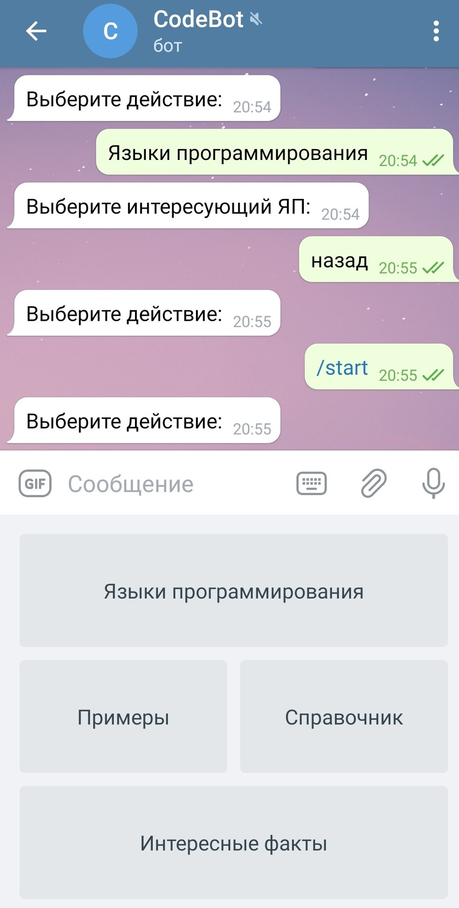
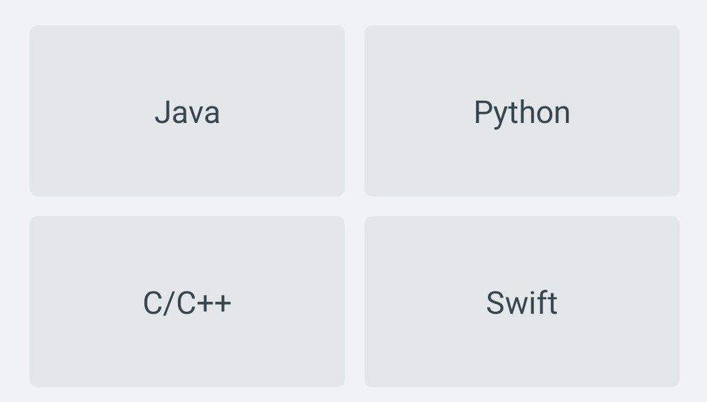

# CodeBot - помощник по программированию

## Описание функций 
###Кнопка «Языки программирования»
 Предоставляет возможность выбрать интересующий язык
программирования среди предложенных и узнать о нём больше
информации.

###*Кнопка «Примеры»*
 Выдает список команд, которые названы в виде различных
конструкций программирования. При нажатии на 
любую из них будет выслан пример работы конструкции
на псевдокоде.
###*Кнопка «Справочник»*
  Также выдает список команд. Каждая команда выдает
информацию по функционалу языков программирования.
###*Кнопка «Интересные факты»*
Создана для развлечения. Эта кнопка высылает один
рандомный факт, связанный с программированием.
## Описание зависимостей
```
<dependency>
            <groupId>org.telegram</groupId>
            <artifactId>telegrambots</artifactId>
            <version>4.8.1</version>
</dependency>
```
```
<dependency>
            <groupId>org.jsoup</groupId>
            <artifactId>jsoup</artifactId>
            <version>1.13.1</version>
</dependency>
```
## Запуск проекта
Для запуска проекта нам понадобится приложение «Telegram».
Нужно зайти в приложение, ввести в строку поиска @HelpCoding_bot
и нажать на кнопку /start.

